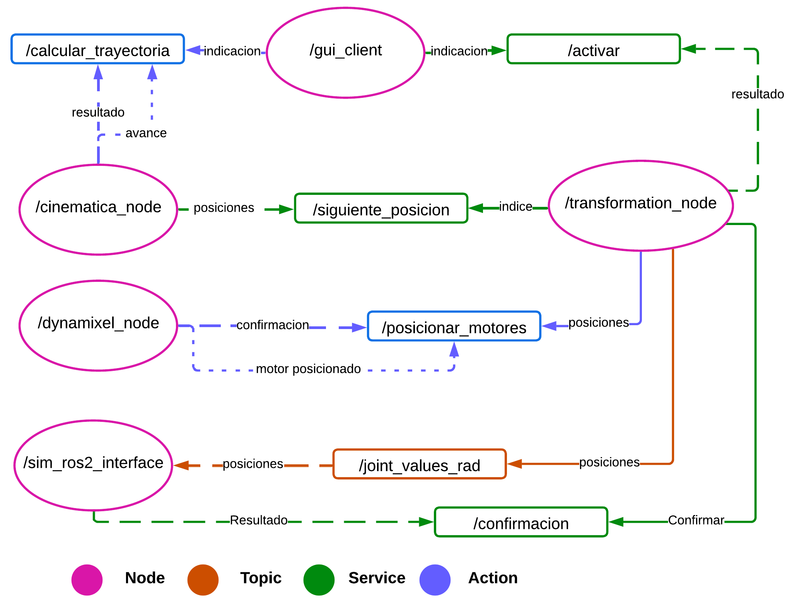

# Hexapod ROS 2

## Authors

* **Andres Camilo Torres Cajamarca** – *Mechatronics Engineering Student*
* **Felipe Chaves Delgadillo** – *Mechatronics Engineering Student*

## Tutors

* **Ph.D. Eng. Pedro Fabián Cárdenas Herrera**
* **Ph.D. Eng. Ricardo Emiro Ramírez Heredia**

## Description

ROS 2 Humble packages for controlling an 18-DOF (Degrees of Freedom) hexapod robot.

## User Manual

### Connection with the Robot

To connect the robot, first plug the power supply into an outlet. Then, connect the Raspberry Pi and turn it on. Wait about one minute for it to establish a network connection.

Once this time has passed, from a computer connected to the same network, run the following commands:

````bash
ssh hexapod@hexapod.local
````

Here, it will ask for a password, which is: ***UNAL2025***.

With this, you now have access to the robot, and locomotion can be executed.

### Launching ROS 2 Nodes

Once you have access to the Raspberry Pi, run:

```bash
tmux 
```

This will allow you to launch the nodes in separate terminals. To open a new terminal, press **Ctrl + B, then C**.
To switch between terminals, press **Ctrl + B, then a number or arrow key**.

In each terminal, run the following commands in the order shown below.

```bash
ros2 run cinematica_node cinematica_node
```

```bash
ros2 run dynamixel_node dynamixel_node
```

```bash
ros2 run transformation_node transformation_node
```

```bash
ros2 run gui_node gui_client
```

Notes:

* Ensure that all nodes are developed. The *gui_node* will remain in a loop until *transformation_node* is launched, and *transformation_node*  will stay in a loop until *cinematica_node* is launched.
* If the U2D2 is not connected, *dynamixel_node* will not work and will attempt to reconnect every 10 seconds.
* Always check the *logger* for information about the status and functionality of the nodes.

In *gui_node*, when you type **'1'**, the program will start, and the trajectory will be calculated in *cinematica_node*.

Then, *transformation_node* will retrieve the first array of positions and attempt to send it to *dynamixel_node* via an action.

Once *dynamixel_node* reaches all the positions, *transformation_node* will retrieve the next position, repeating the process until the user stops it.

## More information

### Understanding ROS2 nodes, topics, services and actions

This project consists of five nodes: three general nodes, one for simulation, and one for hardware. Communication between nodes is handled through topics, services, and actions, as shown below.


