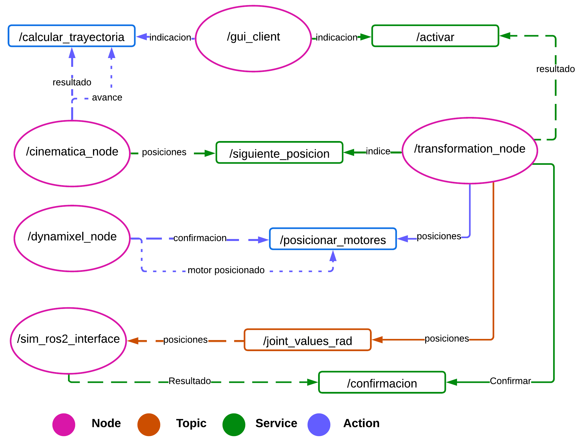

# Hexapod ROS 2

## Authors

* **Andres Camilo Torres Cajamarca** – *Mechatronics Engineering Student*
* **Felipe Chaves Delgadillo** – *Mechatronics Engineering Student*

## Tutors

* **Ph.D. Eng. Pedro Fabián Cárdenas Herrera**
* **Ph.D. Eng. Ricardo Emiro Ramírez Heredia**

## Description

A set of ROS 2 Humble packages designed to control an 18-degree-of-freedom (DOF) hexapod robot, including inverse kinematics, transformation, and motor control nodes.

## User Manual

### Connection with Robot

You can use either the Raspberry Pi connected to the robot or a laptop.

#### Using Laptop

To use these packages, install the following prerequisites:

* [Ubuntu 22.04](https://releases.ubuntu.com/jammy/)
* [ROS 2 Humble](https://docs.ros.org/en/humble/index.html)
* [DynamixelSDK](https://emanual.robotis.com/docs/en/software/dynamixel/dynamixel_sdk/download/)

Then, run the following commands in an Ubuntu terminal:

```bash
git clone https://github.com/antorresca/Hexapod
cd Hexapod
colcon build
source install/setup.bash
```

Once completed, proceed to the Launching ROS 2 Nodes section to run the system.

#### Using Raspberry Pi and SSH

If using the Raspberry Pi via SSH, first ensure that you are connected to the 'LabFabEx' Wi-Fi network. If you do not have the password, please contact the laboratory manager.

Then, in a Windows CMD or a Unix terminal, connect to the Raspberry Pi using the following credentials:

*User: Hexapodo*

*Password: ***ask to team*** *

Run the following command:

```bash
ssh hexapodo@hexapodo
```

Once logged in, proceed to the steps in the ***Launching ROS 2 Nodes*** section.

### Launching ROS 2 Nodes

The following ROS 2 nodes must be launched in this order, using a new terminal (or tmux pane) for each one:

* *gui_node*
* *cinematica_node*
* *transformation_node*
* *dynamixel_node*

```bash
# In separate terminals (or tmux panes), run in this order:
ros2 run gui_node gui_client
ros2 run transformation_node transformation_node
ros2 run cinematica_node cinematica_node
ros2 run dynamixel_node dynamixel_node
```

Notes:

* Ensure that all nodes are properly built and available in your workspace.
* The gui_node will remain in a loop until transformation_node is launched, and transformation_node will stay in a loop until cinematica_node is launched.
* If the U2D2 is not connected, dynamixel_node will not work and will attempt to reconnect every 10 seconds.
* Always check the logger for information about the status and functionality of the nodes.

In *gui_node*, when you type **'1'**, the program will start, and the trajectory will be calculated in *cinematica_node*.

Then, *transformation_node* will retrieve the first array of positions and attempt to send it to *dynamixel_node* via an action.

Once *dynamixel_node* reaches all the positions, *transformation_node* will retrieve the next position, repeating the process until the user stops it.

## More information

### Understanding ROS2 nodes, topics, services and actions

This project consists of five nodes: three general nodes, one for simulation, and one for hardware. Communication between nodes is handled through topics, services, and actions, as shown below.



### Video

https://github.com/user-attachments/assets/06a28685-2799-44d1-bb77-2bedf3dfc20e

